# Diagrams

This file captures the current Canvas Timeline editor, Mediabunny adapter,
export, local media, and proxy decision trees. It reflects the v2 editor's
engine-owned in/out range and viewport, HLS-first adapter loading, timeline
normalization, alternate track selection, playlist rewrite, proxy auth/cache
handling, export memory fixes, local file/URL support, subtitle burn-in, and
framegrabs.

## Frontend Responsibility Map

```mermaid
flowchart TD
    A["EditorScreen creates TimelineEngine"] --> A0["TimelineProvider"]
    A0 --> A1["EditorHeader / EditorLayout / EditorPreview"]
    A0 --> A2["EditorControls / Canvas Timeline surface and track headers"]
    A --> A3["EditorPlaybackSourcePanel / EditorSubtitlePanel"]
    A0 --> B["useEditorTimelineMedia"]
    A0 --> C["useEditorExport"]
    A0 --> E["useEditorKeyboardShortcuts"]
    A0 --> J["useEditorSubtitles"]
    A0 --> K["useEditorFramegrab"]

    B --> B1["editorPlaybackSources track/source analysis"]
    B --> B2["Mediabunny adapter"]
    B --> B3["useTimelineMediaSync"]
    B --> B4["TimelineEngine media clip sourceStart/duration"]
    A2 --> D["CanvasRenderer / RangeSelector / ViewportScrollbar"]
    D --> D1["TimelineEngine playhead/in/out/zoom/scroll"]
    A2 --> D2["Source mute / Sub 1 visibility headers"]

    C --> C1["lazy EditorExportDialog"]
    C --> C2["exportFileName"]
    C --> C3["subtitleExportSummary"]
    C --> C4["exportClip"]
    C4 --> C5["exportMetadata"]
    C4 --> C6["subtitle burn-in processor"]

    K --> H["lazy EditorFramegrabDialog"]
    K --> H1["framegrab canvas helpers"]
    K --> C2

    E --> E1["editorShortcutCommands"]
    J --> J1["useSubtitleCues"]
    J --> J2["selectPreferredSubtitleTrack"]
    J --> J3["Parsed SRT/VTT cues synchronize into Canvas subtitle clips"]
    J3 --> J4["Editable engine subtitle clips feed preview, framegrabs, and export"]

    F["SourcesDialog"] --> F1["useSourcesState"]
    F1 --> F2["sourcesStateUtils"]
    F --> F3["SourcesDialogSections"]
    F3 --> F4["SourceConnectPanel"]

    F4 --> G["ProviderConnectFlow"]
    G --> G1["useProviderConnectFlow"]
    G --> G2["ProviderConnectFlowSections"]

    L["LocalVideoOpenDialog"] --> L1["localMediaRegistry"]
    L1 --> L2["buildLocalEditorSession"]
    L1 --> L3["/api/media/local-url"]
```

## Playback Candidate Tree

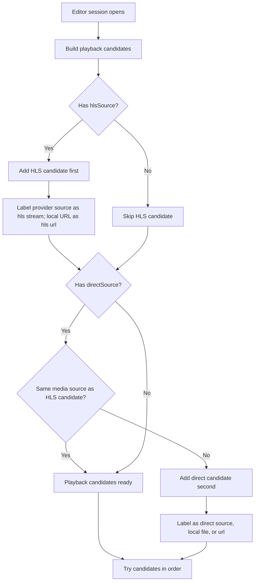

## HLS Track Selection Tree

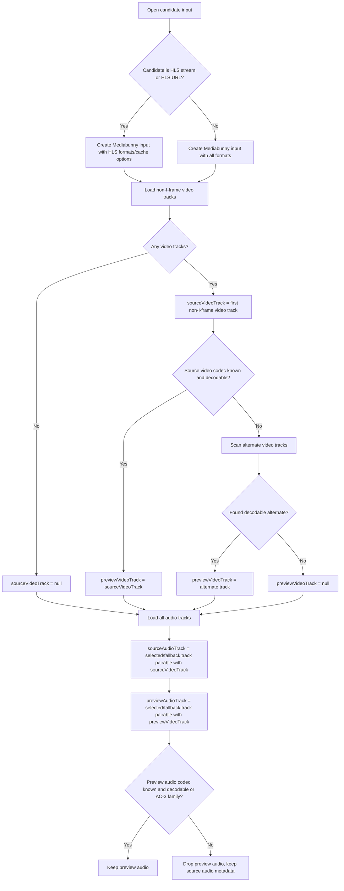

## Source Vs Preview Track Tree

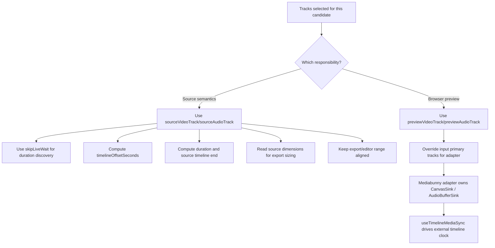

## Playback Fallback Tree

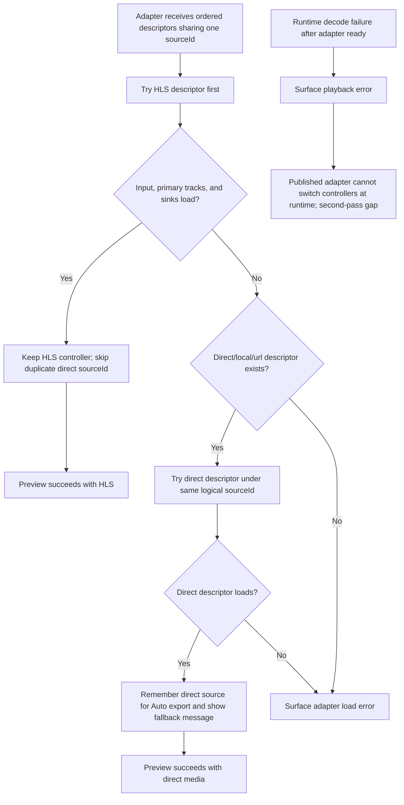

## Adapter Readiness Tree

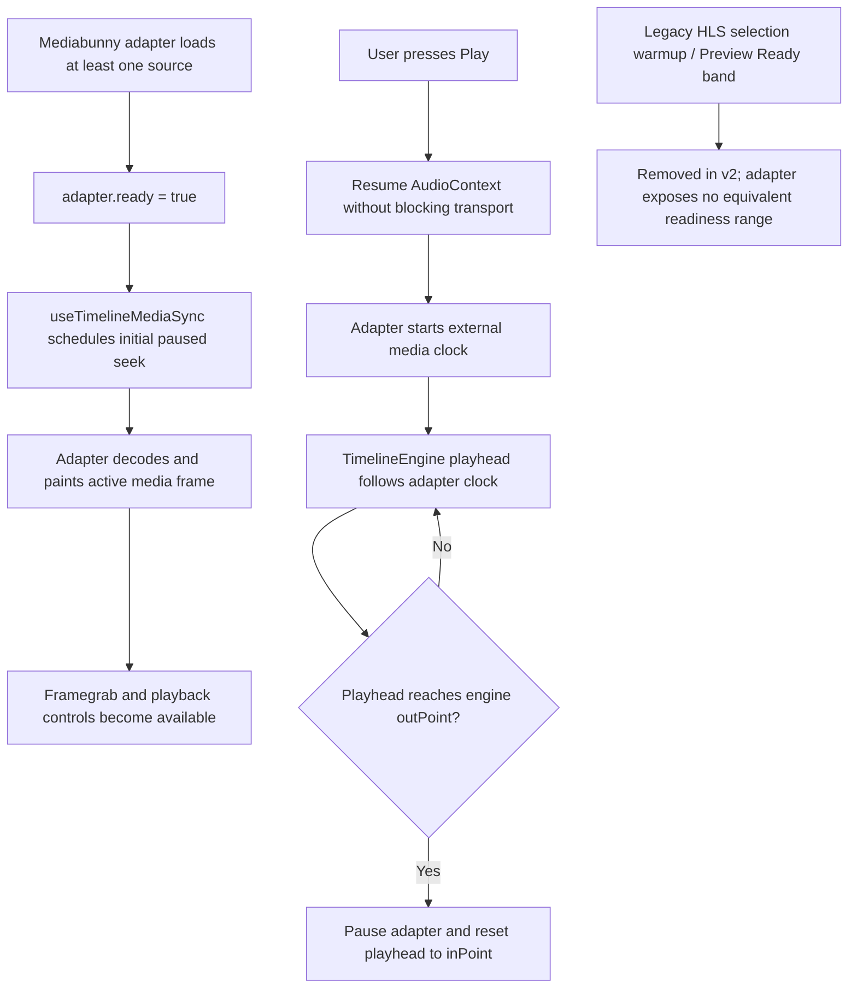

## Export Source Selection Tree

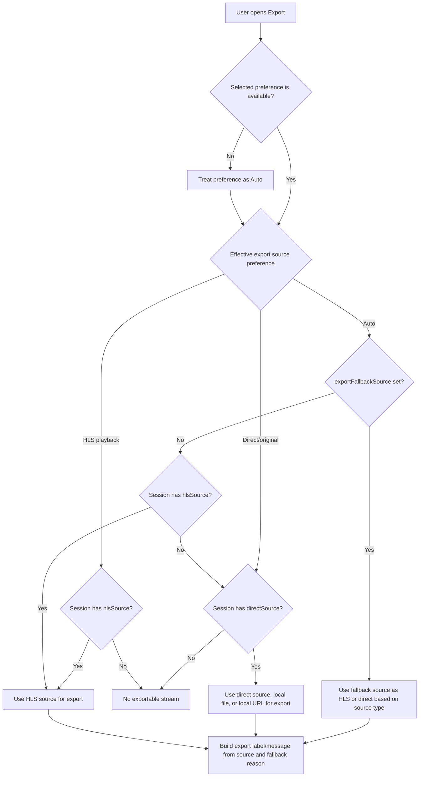

## Timeline Normalization Tree

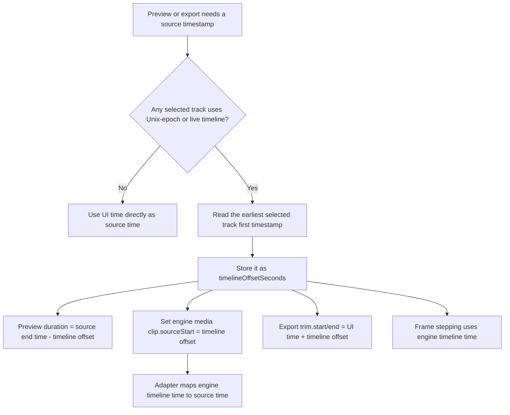

## Playlist Rewrite Tree

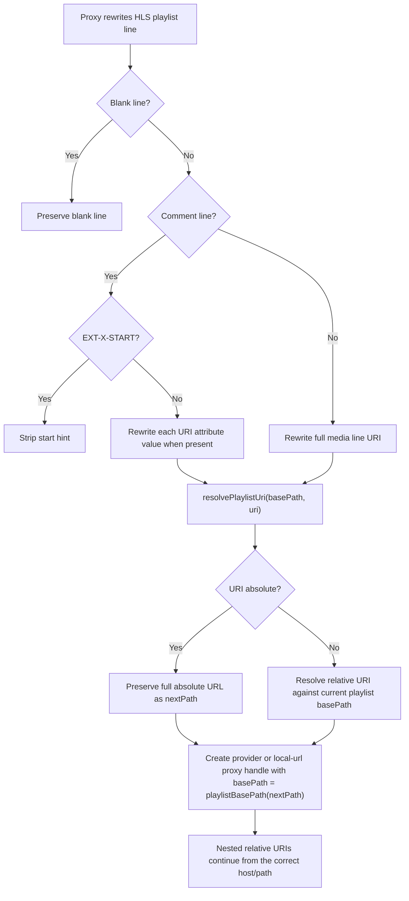

## Local URL Media Flow

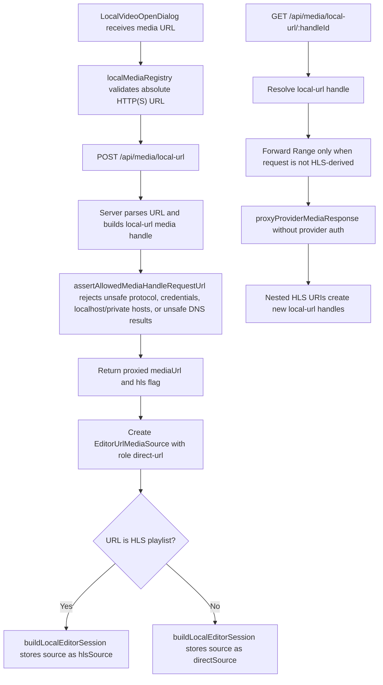

## Proxy Media Request Tree

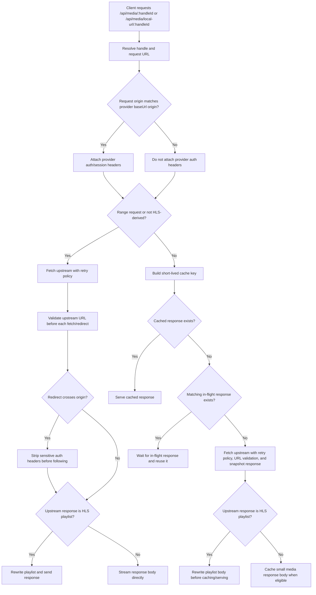

## Export Output Flow

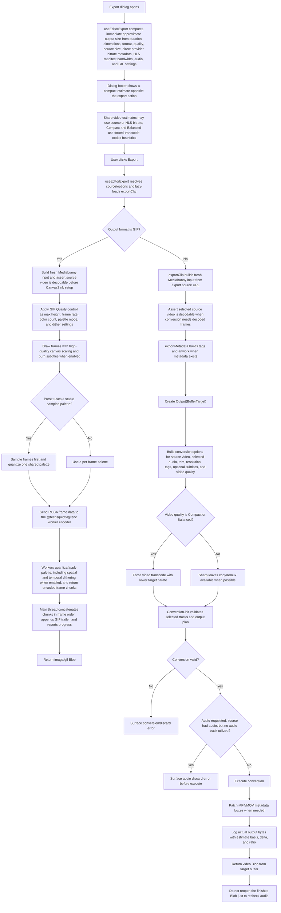

## Subtitle Timeline Invariants

- Canvas Timeline contains one editable subtitle track. The existing text-track
  detection and SRT/VTT parser populate that track once after media duration is
  resolved; user changes are never overwritten by later toggle state.
- `useSubtitleCues` owns selected-track download and parsing only. Parsed cues
  are synchronized into the engine, then read back from engine clips for
  clipping and subtitle export so there is no parallel editable cue model.
- Clip labels are the canonical multiline cue text and timeline start/end values
  are the canonical cue timing values. Source cue identity remains in metadata.
- Track headers use stable `Source` and `Sub 1` labels. Source mute controls the
  preview audio output without hiding video; Sub 1 visibility is engine-owned
  and gates subtitle preview, framegrabs, and export.
- The side panel edits the selected engine clip's text and timing, while
  overlap-safe command previews and commits drive timeline dragging and trims.
- Export and framegrab actions remain blocked while parsed cues are waiting for
  their one-time engine import. Turning subtitles off preserves customized cues.
- Export subtitle burn-in consumes cues reconstructed from engine state.
- The Mediabunny adapter owns media painting. Cliparr draws active engine cues
  on a transparent preview canvas using the adapter's last rendered frame time
  and composites that layer into framegrabs; video and GIF export use the same
  cue conversion and style settings.
- Adding cues, provider-side subtitle writes, and sidecar export/persistence
  remain deferred. Existing imported cues support selection, text editing,
  move, trim, navigation, seek, and deletion.

## End-To-End Summary

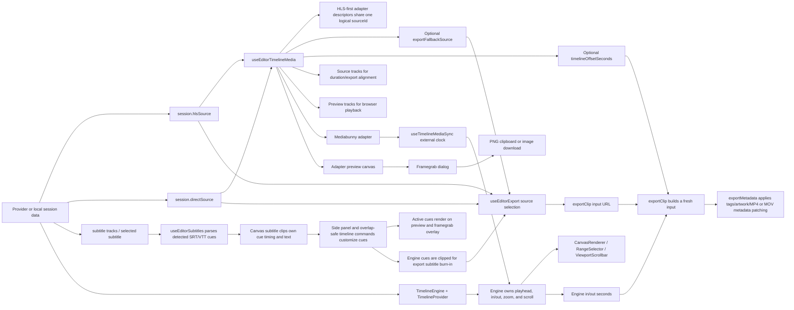
