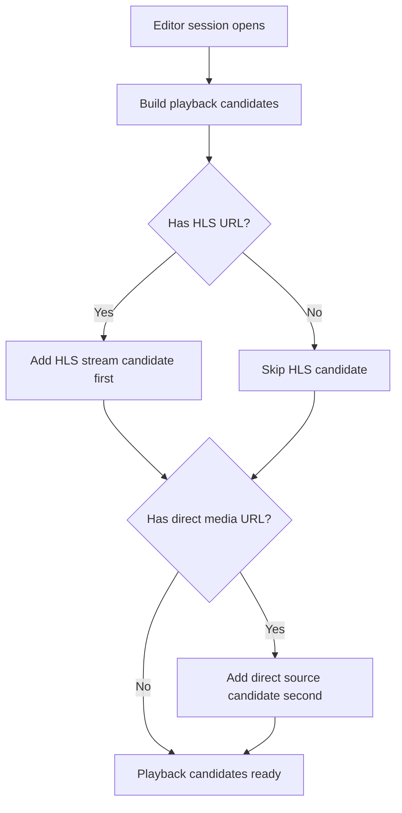
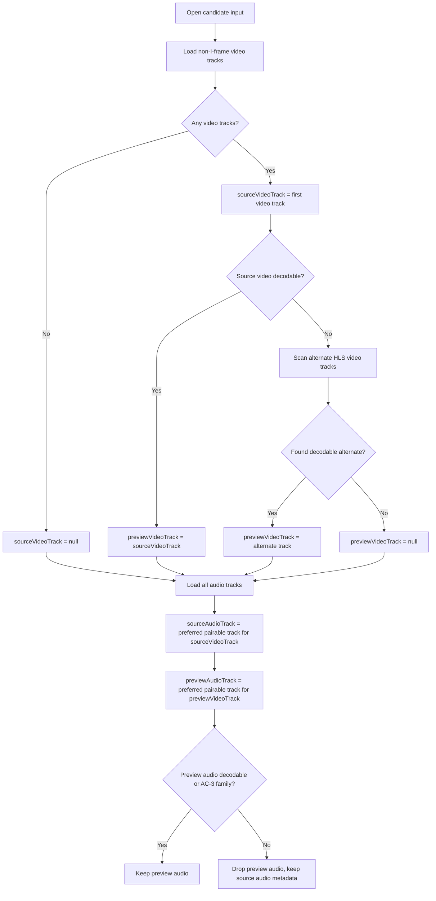
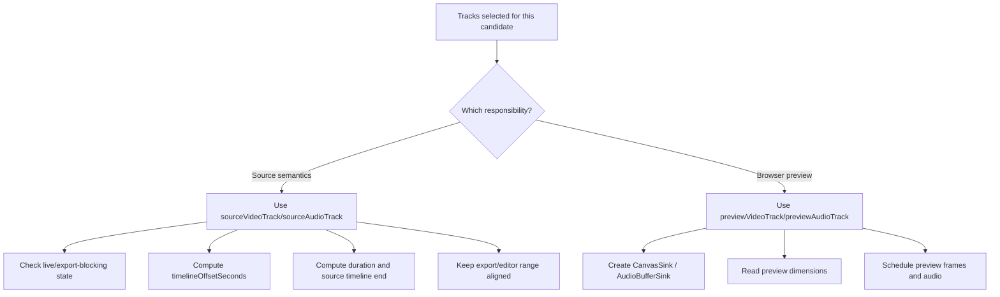
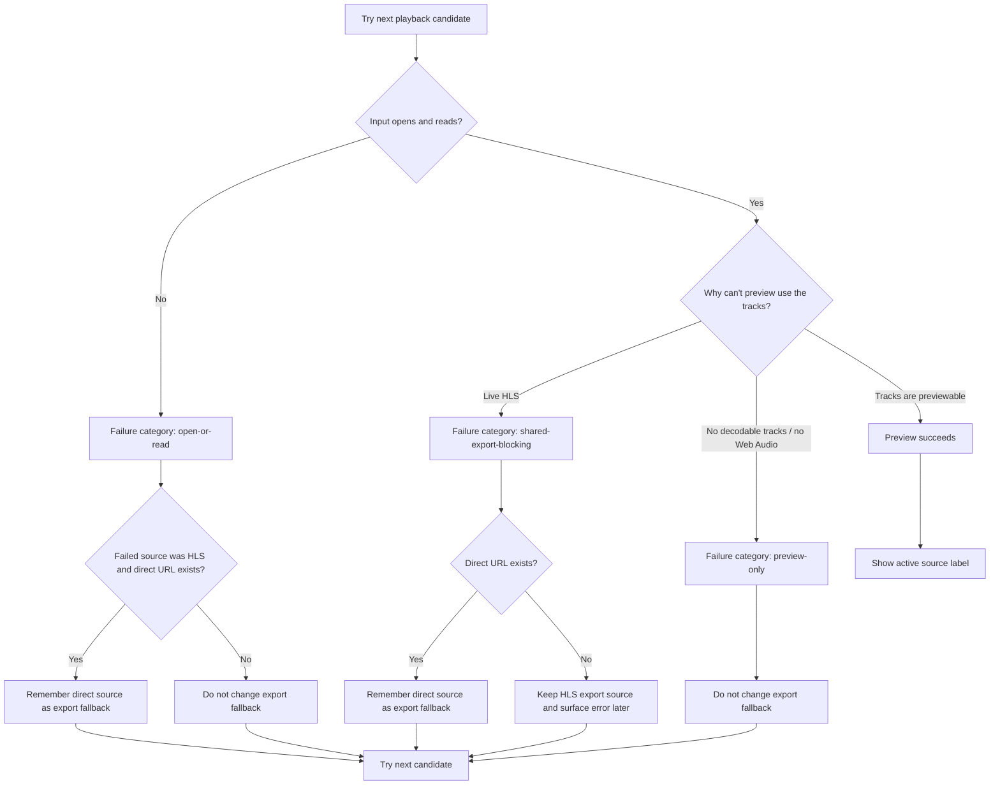
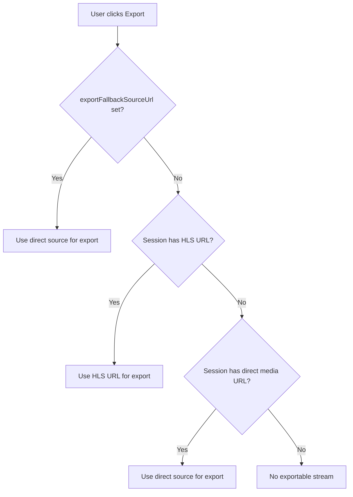
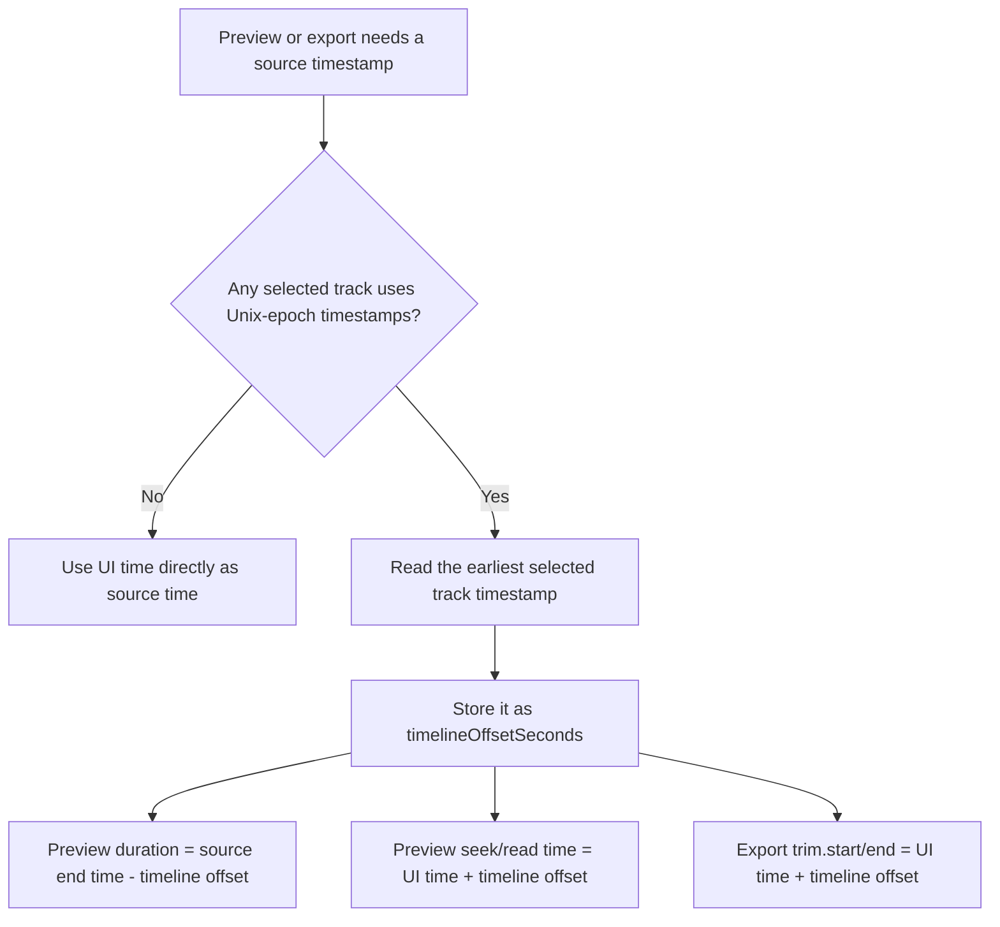
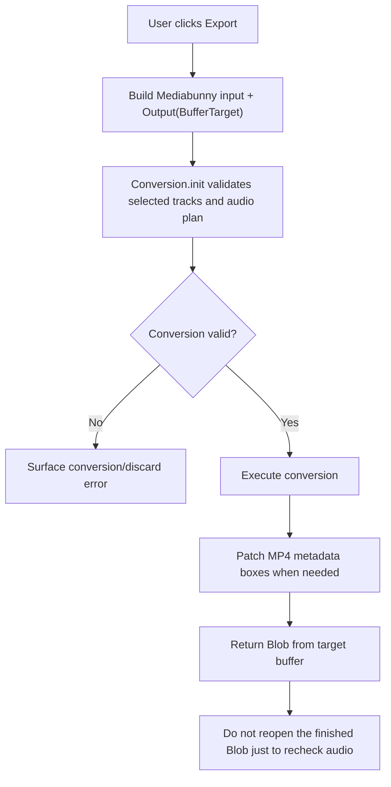
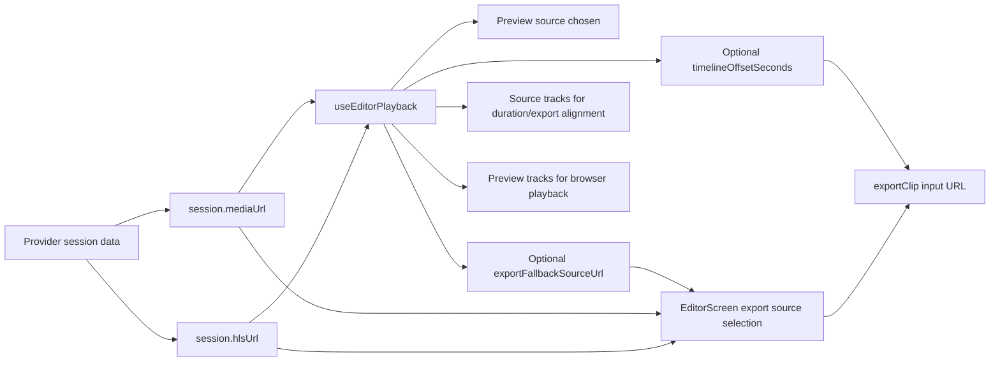

# Diagrams

This file captures the current HLS playback, export, and proxy decision trees.
It reflects the final branch behavior after the fallback, timeline, alternate
track selection, playlist rewrite, and export memory fixes.

## Playback Candidate Tree



## HLS Track Selection Tree



## Source Vs Preview Track Tree



## Playback Fallback Tree



## Export Source Selection Tree



## Timeline Normalization Tree



## Playlist Rewrite Tree

```mermaid
flowchart TD
    A["Proxy rewrites HLS playlist line"] --> B{"Comment with URI attribute?"}
    B -- "Yes" --> C["Rewrite each URI=\"...\" value"]
    B -- "No" --> D["Rewrite full media line URI"]

    C --> E["resolvePlaylistUri(basePath, uri)"]
    D --> E

    E --> F{"URI absolute?"}
    F -- "Yes" --> G["Preserve full absolute URL as nextPath"]
    F -- "No" --> H["Resolve relative URI against current playlist basePath"]

    G --> I["Create proxy handle with basePath = playlistBasePath(nextPath)"]
    H --> I
    I --> J["Nested relative URIs continue from the correct host/path"]
```

## Export Output Flow



## End-To-End Summary


