# Diagrams

This file captures the current playback, preview-ready warmup, export, local
media, and proxy decision trees. It reflects the stable branch behavior after
the fallback, timeline normalization, alternate track selection, playlist
rewrite, proxy auth/cache handling, export memory fixes, local file/URL support,
subtitle burn-in, framegrabs, and the frontend refactor that split large editor
workflows into focused hooks/helpers.

## Frontend Responsibility Map

```mermaid
flowchart TD
    A["EditorScreen"] --> A1["EditorHeader / EditorLayout / EditorPreview"]
    A --> A2["EditorControls / EditorTimeline"]
    A --> A3["EditorPlaybackSourcePanel / EditorSubtitlePanel"]
    A --> B["useEditorPlayback"]
    A --> C["useEditorExport"]
    A --> D["useEditorTimeline"]
    A --> E["useEditorKeyboardShortcuts"]
    A --> J["useEditorSubtitles"]
    A --> K["useEditorFramegrab"]

    B --> B1["editorPlaybackSources"]
    B --> B2["useEditorPlaybackRenderLoop"]
    B --> B3["editorPlaybackAudio"]
    B --> B4["editorPlaybackSinks"]
    B --> B5["useEditorPlaybackWarmup"]
    B --> B6["editorPlaybackPlan"]
    B5 --> B7["useEditorPlaybackSelectionWarmup"]

    C --> C1["lazy EditorExportDialog"]
    C --> C2["exportFileName"]
    C --> C3["subtitleExportSummary"]
    C --> C4["exportClip"]
    C4 --> C5["exportMetadata"]
    C4 --> C6["subtitle burn-in processor"]

    K --> H["lazy EditorFramegrabDialog"]
    K --> H1["framegrab canvas helpers"]
    K --> C2

    D --> D1["timelineZoom helpers"]
    E --> E1["editorShortcutCommands"]
    J --> J1["useSubtitleCues"]
    J --> J2["selectPreferredSubtitleTrack"]

    F["SourcesDialog"] --> F1["useSourcesState"]
    F1 --> F2["sourcesStateUtils"]
    F --> F3["SourcesDialogSections"]
    F3 --> F4["SourceConnectPanel"]

    F4 --> G["ProviderConnectFlow"]
    G --> G1["useProviderConnectFlow"]
    G --> G2["ProviderConnectFlowSections"]

    L["LocalVideoOpenDialog"] --> L1["localMediaRegistry"]
    L1 --> L2["buildLocalEditorSession"]
    L1 --> L3["/api/media/local-url"]
```

## Playback Candidate Tree

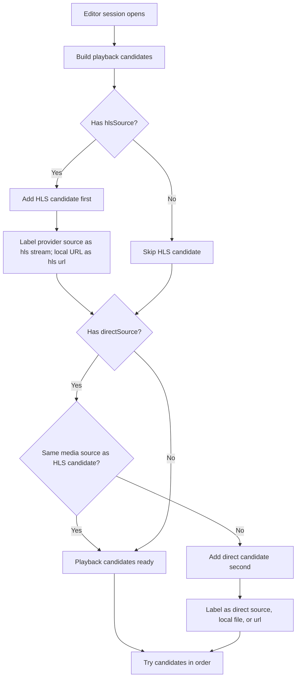

## HLS Track Selection Tree

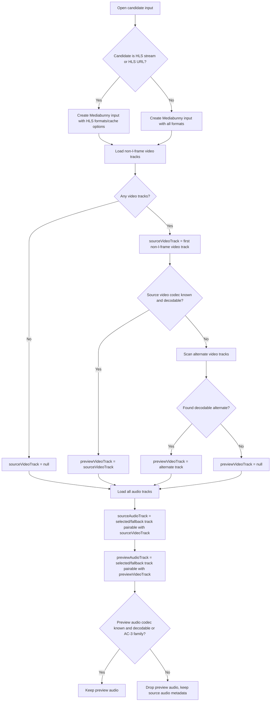

## Source Vs Preview Track Tree

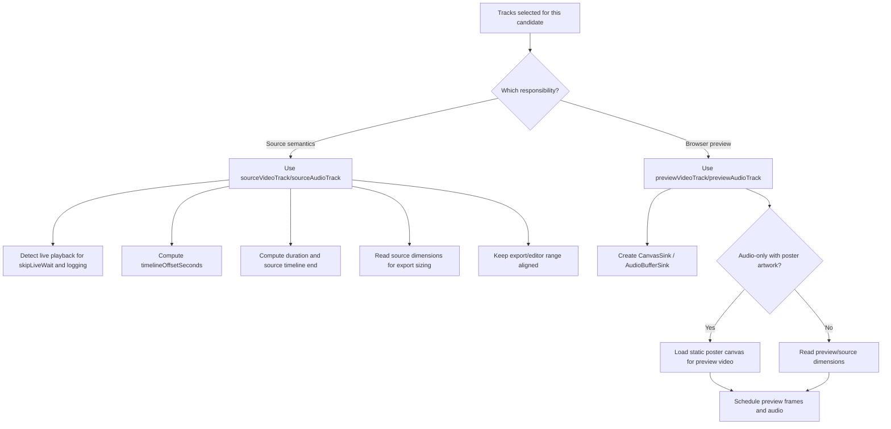

## Playback Fallback Tree

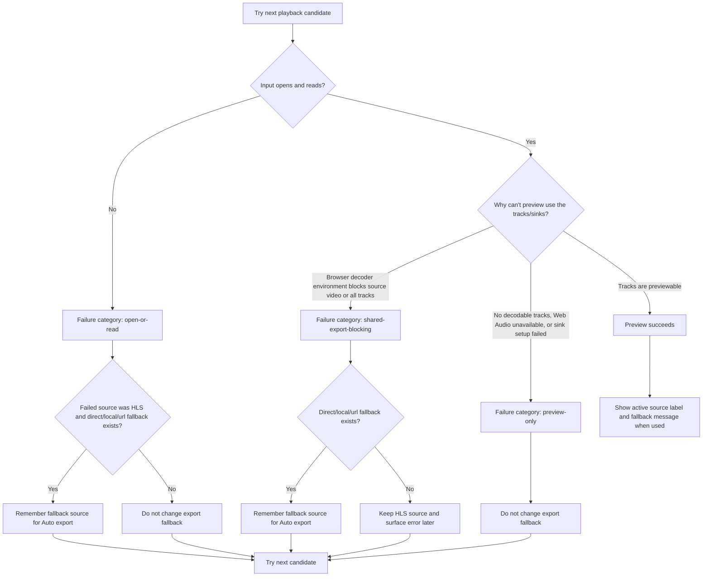

## Preview Ready Warmup Tree

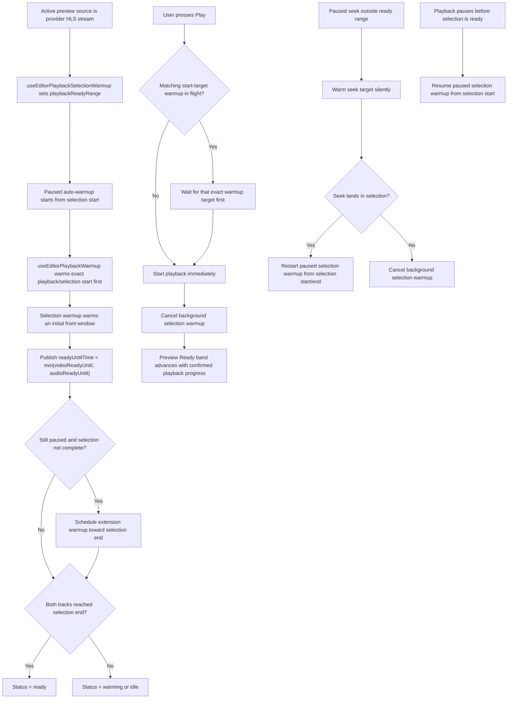

## Export Source Selection Tree

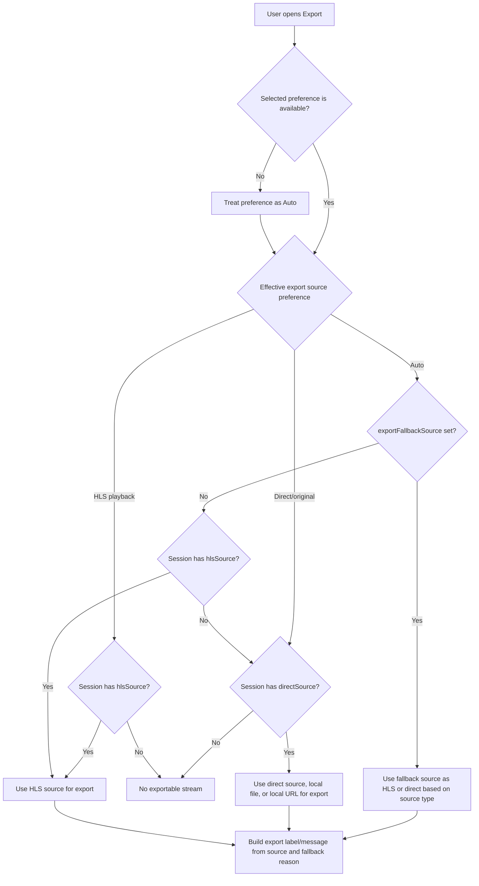

## Timeline Normalization Tree

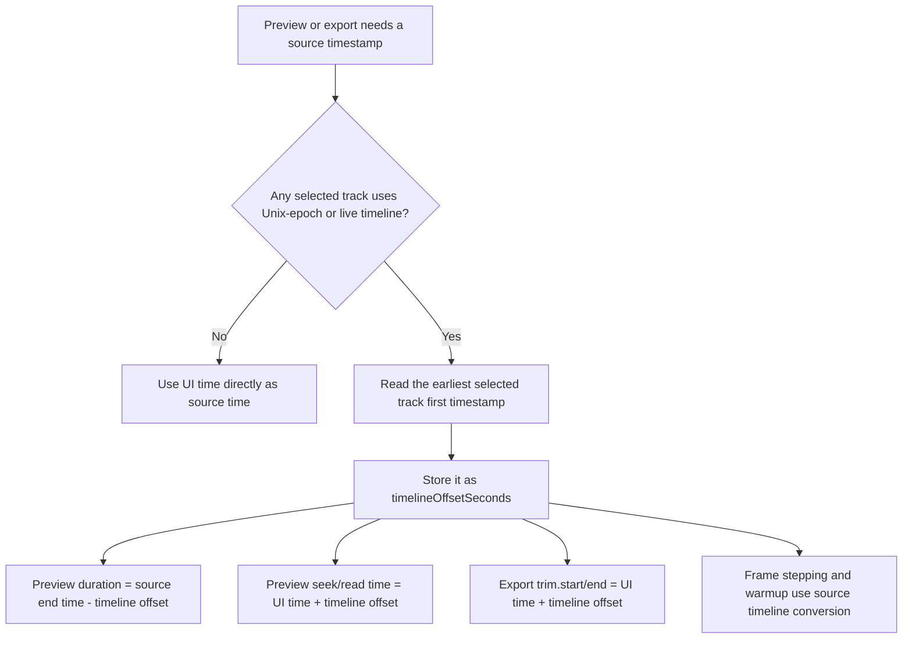

## Playlist Rewrite Tree

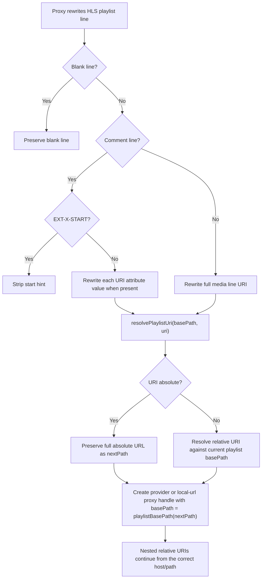

## Local URL Media Flow

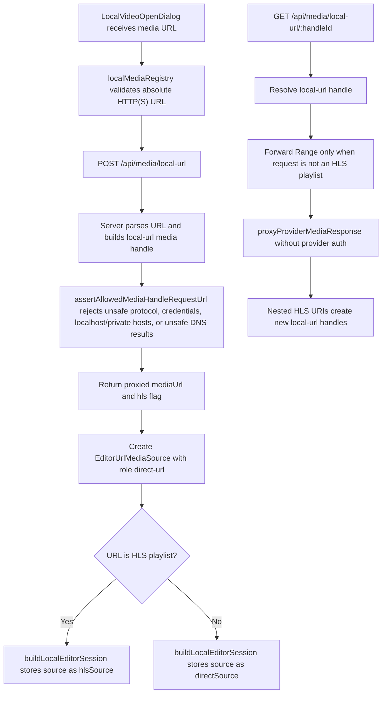

## Proxy Media Request Tree

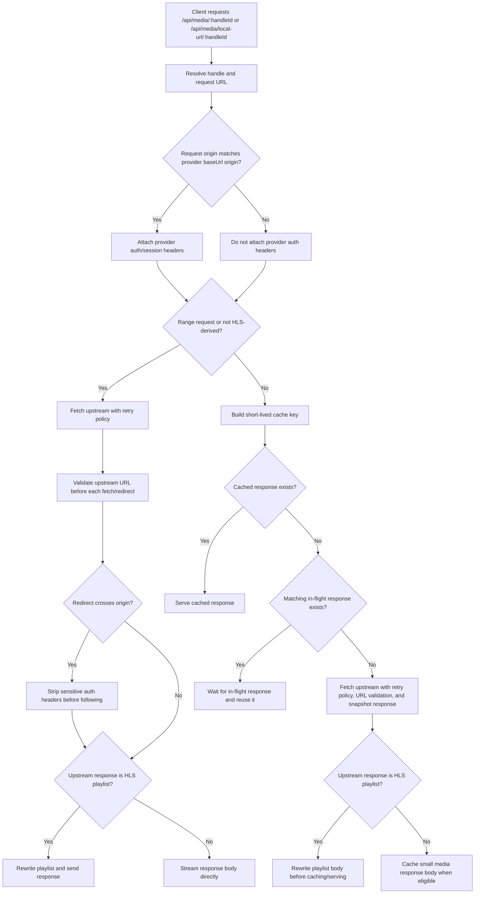

## Export Output Flow

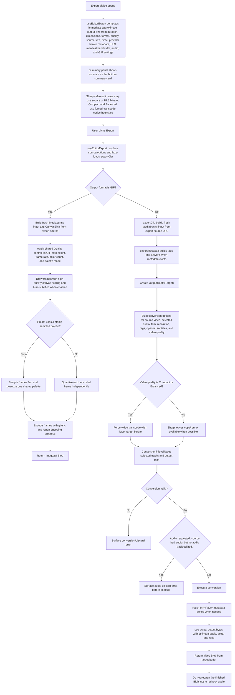

## End-To-End Summary

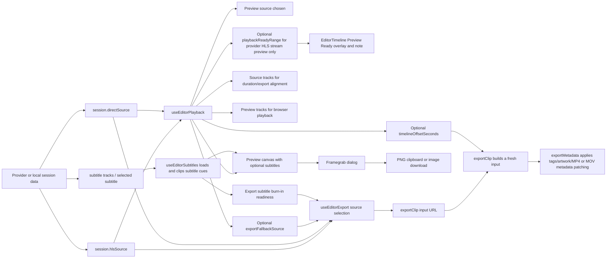
