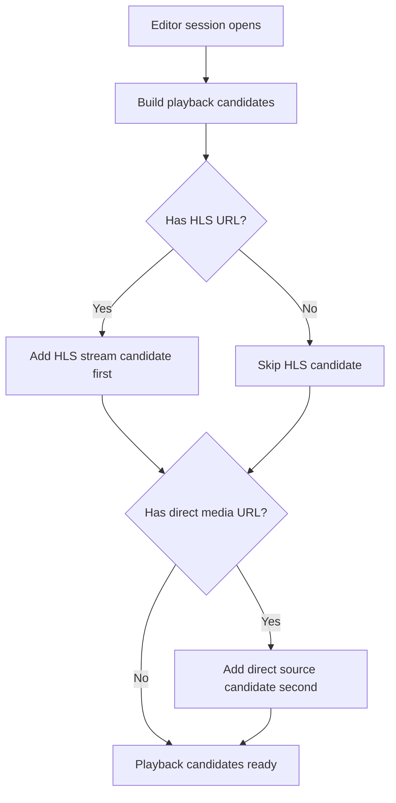
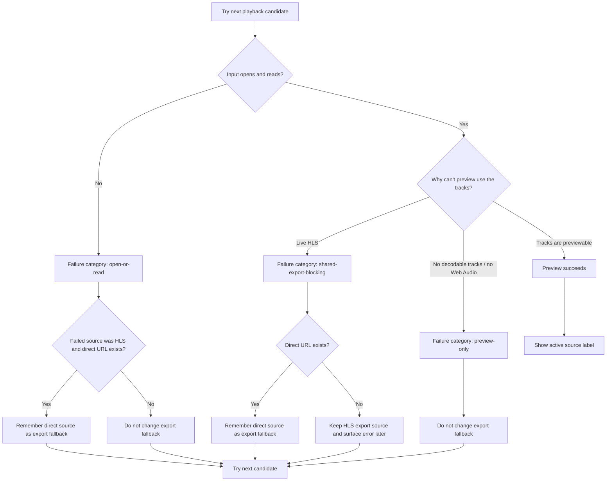
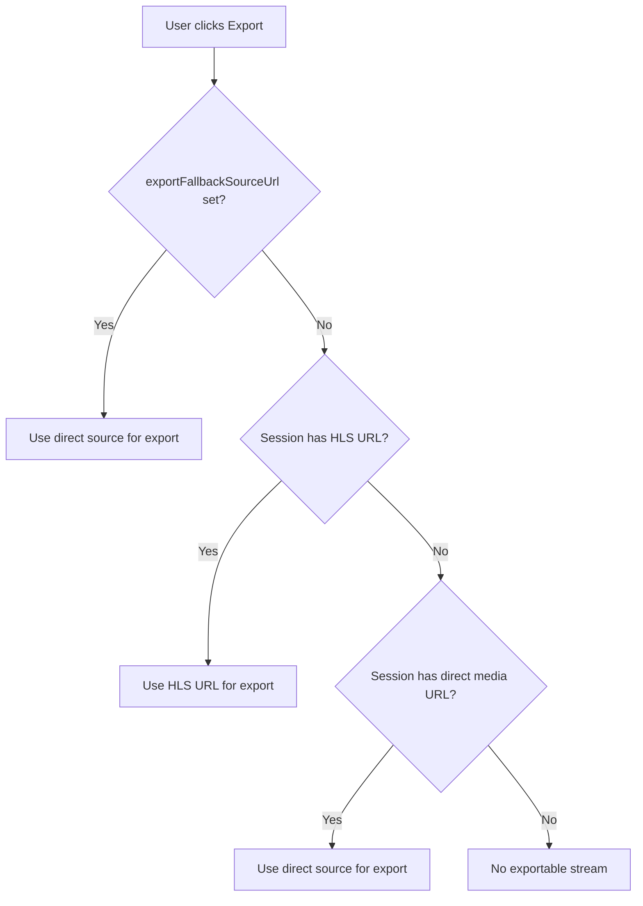
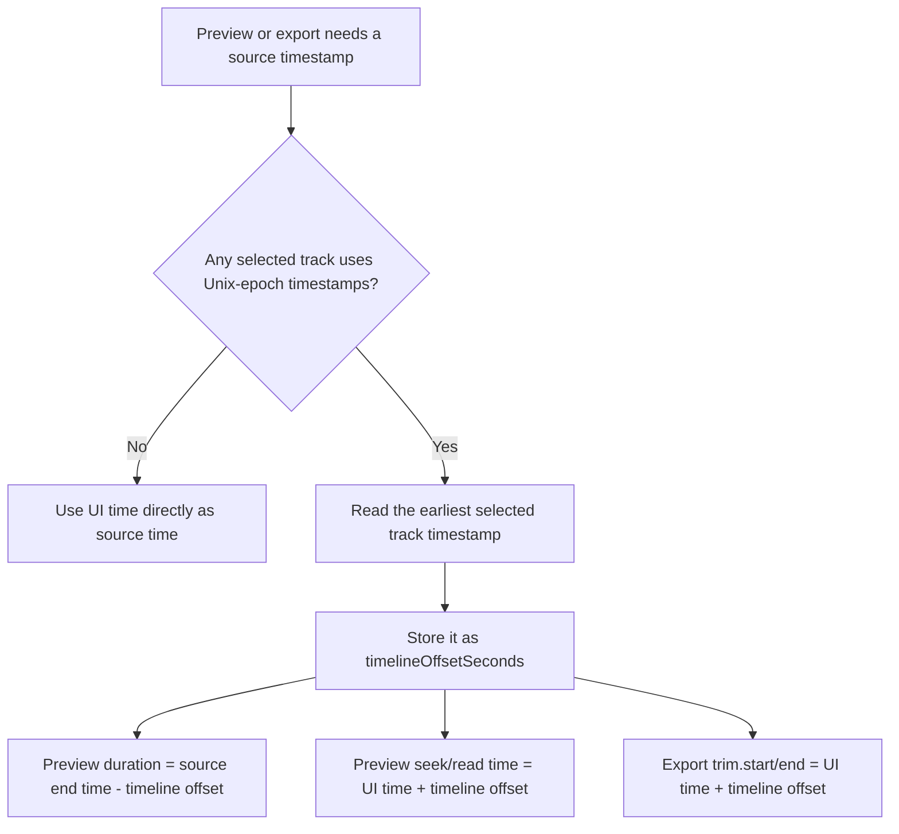
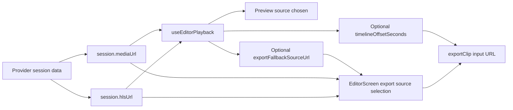

# Diagrams

This file captures the HLS playback and export fallback decision trees behind the
`EditorScreen` review finding.

## Playback Candidate Tree

## Playback Fallback Tree

## Why The Categories Matter

```mermaid
flowchart TD
    A["Preview falls back from HLS"] --> B{"Why couldn't preview use HLS?"}
    B -- "Open/read failure" --> C["HLS is unusable for export too"]
    C --> D["Export should switch to direct source"]

    B -- "Preview-only limitation" --> E["Browser preview cannot use HLS, but export still might"]
    E --> F["Keep HLS as export source"]

    B -- "Shared export-blocking limitation" --> G["Preview and export both reject this HLS path"]
    G --> H["Use direct fallback if available, otherwise leave export blocked"]
```

## Export Source Selection Tree

## Timeline Normalization Tree

## End-To-End Summary

