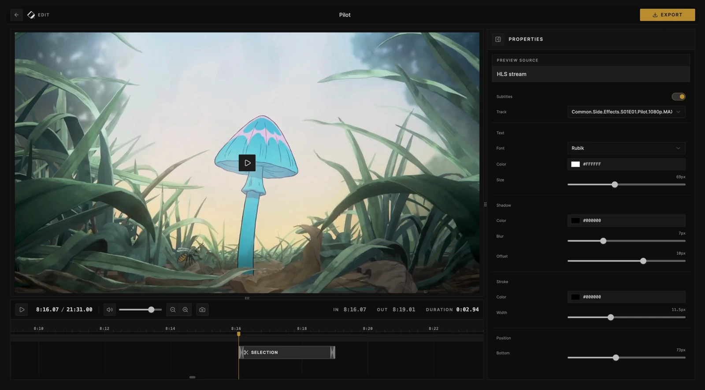

# Cliparr

<div align="center">
  
 <h3>Instant media clipper for your personal media server.</h3>
  <p>
    
    
    
  </p>
</div>

---

**Cliparr** is a streamlined media clipper that allows you to quickly create and download clips from the media currently playing on your Plex or Jellyfin server, or from a local video file opened directly in your browser.



## Features

<!-- CLIPARR_DOCS_SYNC:features:start -->

- **Instant session discovery**: Automatically loads your media player's currently playing file.
- **Open local videos**: Open a local file or direct media URL before or after connecting a provider.
- **Intuitive timeline editor**: Familiar editing controls for choosing the exact clip range.
- **Browser transcoding**: Video exports are powered by <a href="https://mediabunny.dev/" target="_blank" rel="noreferrer">Mediabunny</a>, with short dithered GIFs encoded in browser workers.
- **Metadata included**: Video exports can include season, episode, and timing metadata from your source.
- **Subtitle burn-in**: Burn in supported subtitles with customizable styling and local font support in Chromium.
<!-- CLIPARR_DOCS_SYNC:features:end -->

## Getting Started

### Quick Start with Docker

<!-- CLIPARR_DOCS_SYNC:docker-quick-start:start -->

The fastest way to get Cliparr running is via the GitHub Container Registry.

**macOS / Linux**

```bash
docker run -d \
  --name cliparr \
  -p 7171:7171 \
  -e APP_KEY="your-32-char-stable-random-secret" \
  -v cliparr-data:/data \
  ghcr.io/techsquidtv/cliparr:latest
```

**PowerShell**

```powershell
docker run -d `
  --name cliparr `
  -p 7171:7171 `
  -e APP_KEY="your-32-char-stable-random-secret" `
  -v cliparr-data:/data `
  ghcr.io/techsquidtv/cliparr:latest
```

On Windows, run this from Docker Desktop or another Docker engine using Linux containers. Cliparr publishes Linux container images for linux/amd64 and linux/arm64.

> [!IMPORTANT]
> **Stable APP_KEY required**: Cliparr uses APP_KEY to encrypt provider credentials at rest. Use a stable random secret at least 32 characters long. If you change it later, you will need to re-authenticate your media servers.

> [!IMPORTANT]
> **Use HTTPS for editing**: Cliparr's editor uses browser WebCodecs. Supporting browsers require a secure context, so use HTTPS through a reverse proxy or open Cliparr on localhost or 127.0.0.1.

<!-- CLIPARR_DOCS_SYNC:docker-quick-start:end -->

### Local Videos

Use **Open Video** on the connect screen or dashboard to open a file from your device or a direct media URL. Files are read by the browser with Mediabunny and are not uploaded to the Cliparr server. Browsers that support persistent file handles can reopen the selected file after refresh once you grant permission again; other file input and drag-and-drop sessions stay available only while the tab is open.

URL media streams through Cliparr's media proxy. The URL must use HTTP or HTTPS, be reachable from the Cliparr server, and not point at a blocked internal address. For smooth seeking and clipping, use URLs that support byte-range requests. HLS `.m3u8` URLs can be opened when Cliparr can fetch the playlist and its segment URLs.

### Using Docker Compose

For a persistent setup, we recommend using Docker Compose:

```yaml
services:
  cliparr:
    image: ghcr.io/techsquidtv/cliparr:latest
    container_name: cliparr
    ports:
      - "7171:7171"
    environment:
      - APP_KEY=replace-this-with-a-32-character-secure-random-string
    volumes:
      - cliparr-data:/data
    restart: unless-stopped

volumes:
  cliparr-data:
```

## Configuration

<!-- CLIPARR_DOCS_SYNC:configuration:start -->

| Variable                               | Description                                                                                                                        | Default                  |
| :------------------------------------- | :--------------------------------------------------------------------------------------------------------------------------------- | :----------------------- |
| `APP_KEY`                              | Required secret for credential encryption. Must be at least 32 characters long.                                                    | `-`                      |
| `PORT`                                 | Internal port for the Express server.                                                                                              | `7171 prod / 3000 dev`   |
| `CLIPARR_DATA_DIR`                     | Directory for SQLite storage.                                                                                                      | `/data`                  |
| `CLIPARR_LOG_LEVEL`                    | Server log level. Supports trace, debug, info, warning, error, and fatal. Defaults to debug in development and info in production. | `debug/info`             |
| `CLIPARR_LOG_FORMAT`                   | Production server console log format. Development console logs are always JSON.                                                    | `json dev / pretty prod` |
| `CLIPARR_LOG_FILE`                     | Optional path for a rotating server log file. Relative paths resolve from the server working directory.                            | `-`                      |
| `CLIPARR_LOG_FILE_FORMAT`              | Optional log file format. Defaults to CLIPARR_LOG_FORMAT when set, otherwise json.                                                 | `json`                   |
| `CLIPARR_LOG_FILE_MAX_SIZE`            | Maximum size for each rotating server log file. Supports kb, mb, and gb suffixes.                                                  | `10mb`                   |
| `CLIPARR_LOG_FILE_MAX_FILES`           | Total number of rotating server log files to keep, including the active file.                                                      | `5`                      |
| `CLIPARR_ALLOW_LOOPBACK_JELLYFIN_URLS` | Allow Jellyfin URLs that resolve to localhost or loopback. Use only for trusted self-hosted setups.                                | `false`                  |

<!-- CLIPARR_DOCS_SYNC:configuration:end -->

When running behind a reverse proxy, preserve the `Host` header and pass `X-Forwarded-Proto`. Cliparr trusts loopback, link-local, and private-LAN proxy ranges directly in the app, so typical Caddy/Nginx/Traefik setups on the same network do not need extra app configuration. Caddy already forwards the needed headers.

Cliparr does not include a full app-level user or permission system. If you need to limit who can open the app, keep it on a trusted network or put it behind an authenticated reverse proxy. See the [access control guide](https://cliparr.dev/docs/access-control) for recommended deployment patterns.

## Development

We welcome contributions! To get started with a local development environment:

1. **Clone**: `git clone https://github.com/techsquidtv/cliparr.git`
2. **Setup**: `cp .env.example .env` (and fill in `APP_KEY`)
3. **Install**: `pnpm install`
4. **Run**: `pnpm dev`

The optional Docker dev stack (`docker-compose.dev.yml`) seeds Plex and Jellyfin with Sintel, a Blender open movie with embedded subtitle tracks. Run `pnpm docker:dev:build` after Dockerfile or dependency changes, then `pnpm docker:dev:up` to start the stack. The seed is skipped when `CI=true` or `GITHUB_ACTIONS=true` so CI jobs do not download the large test movie. If you previously used the old Big Buck Bunny seed, recreate the `cliparr-dev-media`, `plex-config`, and `jellyfin-config` Docker volumes to force a clean library scan.

See [CONTRIBUTING.md](CONTRIBUTING.md) for more detailed guidance.

## License

Cliparr is released under the [MIT License](LICENSE).
