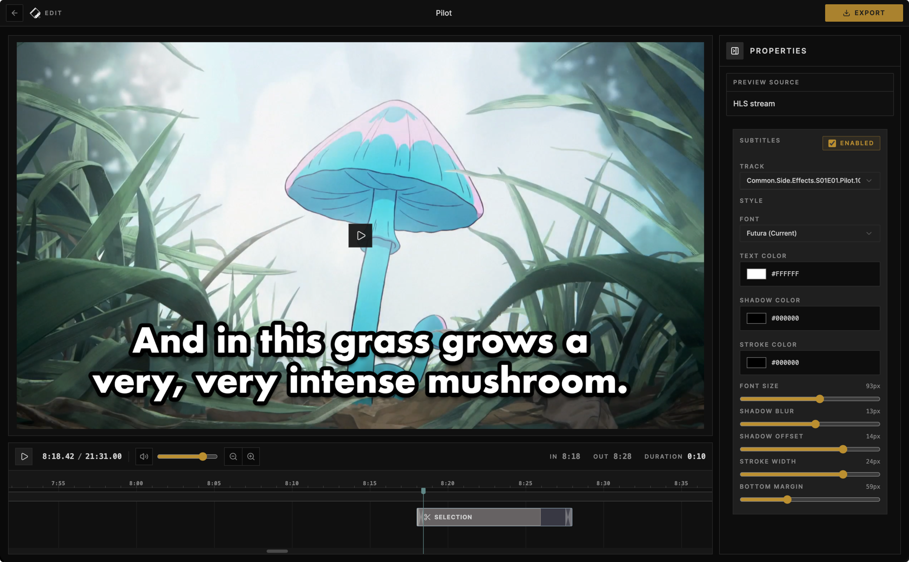

# Cliparr



Media clipper for pulling quick MP4s out of whatever is currently playing on your personal media server.

Cliparr connects to Plex, finds active playback sessions, lets you mark a clip range on a timeline, previews the original media in the browser, and exports an MP4 without setting up a heavyweight editing pipeline.

- Instantly loads your media player's currently playing file.
- Intuitive single-track editor for selecting clip
- Advanced metadata tagging. Clip will include rich exif data, like Season and Episode numbers, and timing data.
- Select resolution; transcoding happens in-browser.

Built with [Mediabunny](https://mediabunny.dev/) and [`react-timeline-editor`](https://github.com/xzdarcy/react-timeline-editor).


## Docker

### GitHub Container Registry

The easiest way to run Cliparr is using the official image from the GitHub Container Registry:

```sh
export APP_KEY="replace-with-a-stable-random-secret"

docker run --rm -p 3000:3000 \
  -e APP_URL=http://localhost:3000 \
  -e APP_KEY="$APP_KEY" \
  -v cliparr-data:/data \
  ghcr.io/techsquidtv/cliparr:latest
```

Cliparr requires SQLite storage for configured media sources and provider tokens. The container stores that database under `/data`, so mount it as a volume.
`APP_KEY` is required and must stay the same for a given data directory because Cliparr uses it to encrypt persisted provider credentials at rest.

### Docker Compose

For local Docker usage, Compose will build the image and mount the database volume for you:

```sh
cp .env.example .env
# Set APP_KEY in .env before starting the stack.
docker compose up --build
```

### Local Build

If you want to build the image locally:

```sh
docker build -t cliparr .
```

And run it:

```sh
export APP_KEY="replace-with-a-stable-random-secret"

docker run --rm -p 3000:3000 \
  -e APP_URL=http://localhost:3000 \
  -e APP_KEY="$APP_KEY" \
  -v cliparr-data:/data \
  cliparr
```


## Contributing

See [CONTRIBUTING.md](CONTRIBUTING.md) for local development and pull request guidance.

Please report security concerns privately. See [SECURITY.md](SECURITY.md).

## License

Cliparr is released under the [MIT License](LICENSE).
