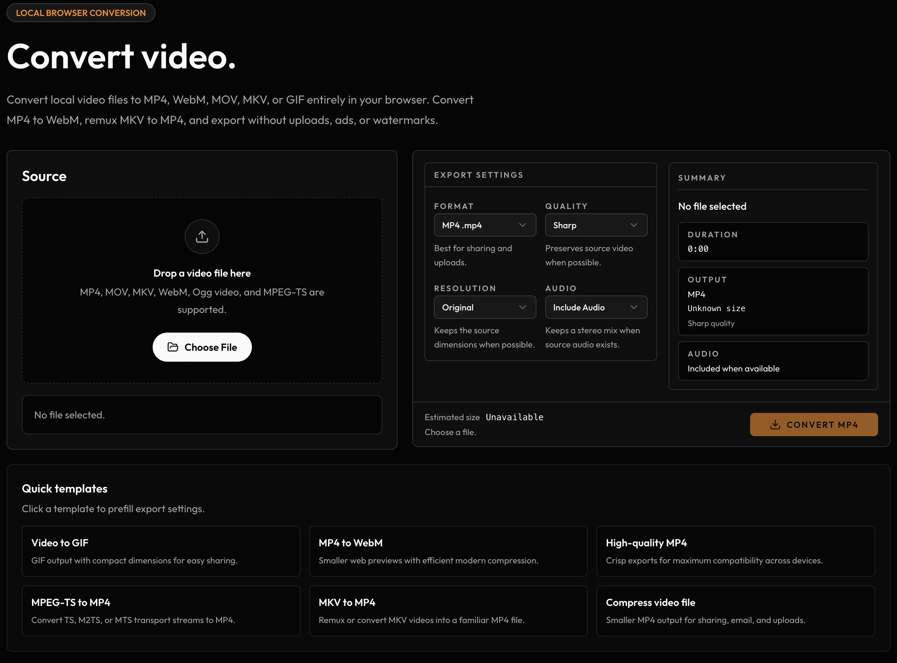

Though Cliparr is intended for creating clips from longer videos, it is also an effective video converter.
But the editing UI can get in the way if you just want to quickly convert a full video.

Because Cliparr already transcodes in the browser, it made sense to pull that part out into something smaller: [Cliparr Convert](/convert/), a simple offline video converter on the public Cliparr site.

If you're looking for a simple, ad-free, in-browser, no-account-needed video converter, give it a try.
Use it to compress MP4s, convert MKVs to more compatible MP4s, make WebMs for the web, or turn short videos into GIFs without self-hosting anything.

Powered by [Mediabunny](https://mediabunny.dev/) and [gifenc](https://github.com/KyleTryon/gifenc), Cliparr Convert supports the same kind of browser-side video export flow as the full app, just without the timeline editor and media provider setup around it.

## The GIF Rabbit Hole

In [version 1.1.0](/changelog/#v1.1.0) of Cliparr, I added GIF export support. That same code is now powering GIF output in [Cliparr Convert](/convert/).

Before adding GIF support, it was important to produce good-looking GIFs that felt "worth it" for what is essentially a dead format.
When you can post an MP4 or WebM, you should; but there are still some platforms out there where GIFs are the only option.

Understandably, Mediabunny, the core media library behind Cliparr's browser exports, didn't support GIF output, and the native JavaScript options I found just didn't produce GIFs I was happy with.

Eventually I discovered the Rust-based [gifski](https://github.com/ImageOptim/gifski) library, which produced _beautiful_ GIFs, but for a number of reasons, it was not easy to get working with Cliparr and was not a good fit for this project anyway.

Among many other things gifski does, the most impactful is a simple dithering option to reduce banding. I went back to the best option we had for JavaScript, [gifenc](https://github.com/mattdesl/gifenc), but the problem is that it has not been updated in years, and its README explicitly points out that dithering is not supported.

So, with the help of ChatGPT Codex, I forked the repo, updated it to a modern TypeScript codebase, and added basic dithering support, which made a huge difference in quality right away.

Don't worry, I did [send over a patch](https://github.com/mattdesl/gifenc/pull/21) with the dithering support to the original repo. We'll see if it gets merged. If you want to check it out yourself, you can find the fork with the dithering support on [GitHub](https://github.com/KyleTryon/gifenc).

You can also check out the [benchmarking page](https://kyletryon.github.io/gifenc/bench/video-report/) where you can compare the performance and quality of different options for creating GIFs.
You'll see I attempted adding temporal dithering, but to my eye it just looks a little worse.

If you're looking for an easy way to convert video files or create higher-quality GIFs locally, give [Cliparr Convert](/convert/) a try.
